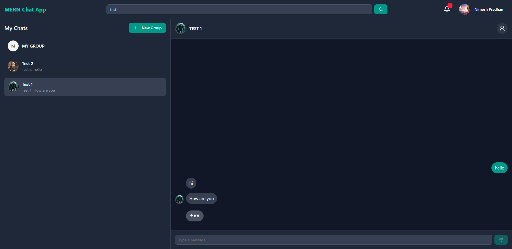
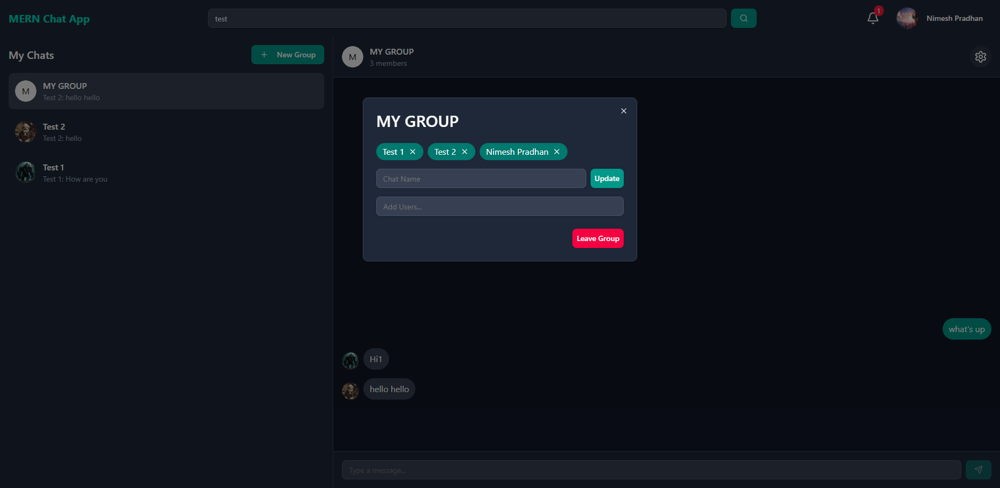
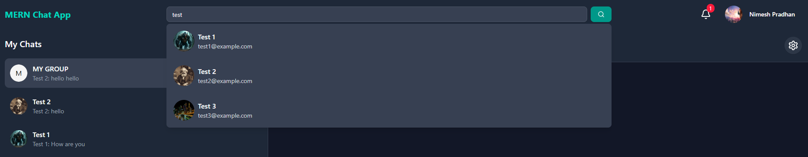

# MERN Chat App

A real-time chat application built using the **MERN** stack: **MongoDB**, **Express**, **React**, and **Node.js**. The app supports **one-on-one chats**, **group chats**, and includes **real-time messaging** via **Socket.IO**. If a user is offline or not actively in the chat, they receive **notifications** for new messages.

### 🔗 Live Demo

[Click here to view the live app](https://mern-chat-app-bg6g.onrender.com)

## 🔑 Authentication

- JWT-based authentication system
- Secure user login and registration

## ✨ Features

- 💬 One-on-One Chat
- 👥 Group Chats
- 🔔 Real-Time Notifications
- ⚡ Real-Time Messaging with Socket.IO
- 🗂 RESTful API using Express and MongoDB

## 🛠 Tech Stack

**Frontend:**
- React
- Axios
- Socket.IO Client

**Backend:**
- Node.js
- Express.js
- MongoDB (with Mongoose)
- Socket.IO
- JSON Web Tokens (JWT)

### Screenshot 1

### Screenshot 2

### Screenshot 3

